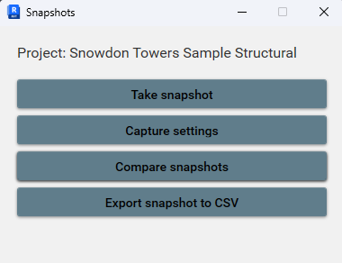
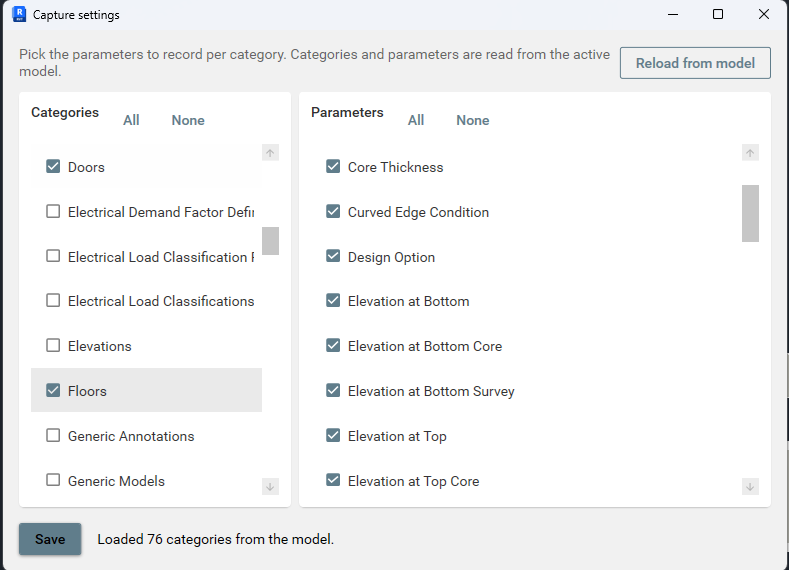
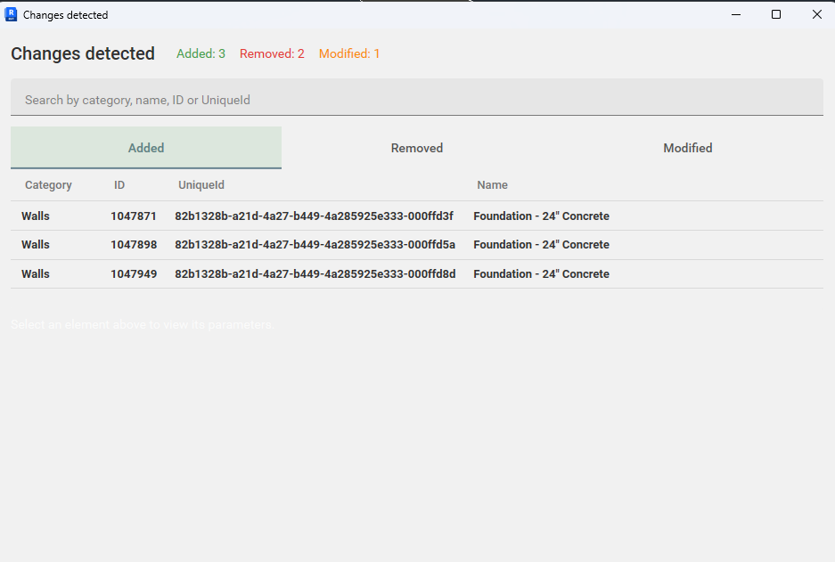

# Revit Tracking Comparison

[Русский](README.ru.md)

A Revit 2026 add-in that captures the state of your model over time and compares two snapshots to show what changed—added, removed, or modified elements and parameters.

## What it does

1. **Snapshot** — Records selected categories and parameters from the active document: element identity, position, creation time, and property values.
2. **Store** — Saves each snapshot as a LiteDB database on disk (one file per capture).
3. **Compare** — Diff two snapshots and present the result in a WPF UI (added / removed / modified).
4. **Act on changes** — Edit parameter values from the comparison view and push them back into the live Revit model.
5. **Export** — Export a snapshot or comparison to CSV for use in Excel.

Typical workflow: take a baseline snapshot, change the model, take another snapshot, then open **Compare** to review differences.

## Screenshots

### Snapshot hub

Take snapshots, open capture settings, compare, or export to CSV.

### Capture settings

Choose which categories and parameters are recorded from the active model.

### Compare snapshots

Review added, removed, and modified elements; drill into parameter changes.

## Features

| Feature | Description |
|--------|-------------|
| **Snapshot hub** | Ribbon: **Add-Ins** → **Snapshot tracking** → **Snapshots** — take snapshots, open capture settings, start a comparison. |
| **Capture settings** | Choose which categories and which parameters per category are stored (`capture-config.json`). |
| **First snapshot on open** | When you open a project that has no snapshots yet, the add-in creates an initial snapshot automatically. Later snapshots are manual. |
| **Responsive capture** | Model reads run in batches on the Revit API thread so the UI stays responsive during large models. |
| **CSV export** | Export snapshot or diff data for reporting outside Revit. |

## Requirements

- **Autodesk Revit 2026** (64-bit)
- **Windows** x64
- **.NET 8** (runtime used by the add-in; Revit 2026 provides the host)

## Installation

### [Download installer v1.0.0](https://github.com/AleksandrPidlozhevich/RevitTrackingComparison/releases/tag/v1.0.0)

On the [release page](https://github.com/AleksandrPidlozhevich/RevitTrackingComparison/releases/tag/v1.0.0), download **RevitTrackingComparison.Installer.msi**, run it **as administrator**, then restart Revit 2026.

The add-in appears on the ribbon under **Add-Ins** → **Snapshot tracking** → **Snapshots**.

**Uninstall:** Windows **Settings** → **Apps** → **Revit Tracking Comparison**, or **Programs and Features**. This removes the add-in from `%ProgramData%\Autodesk\Revit\Addins\2026\` and deletes `%AppData%\TrackingComparison\` (snapshots, logs, capture settings) for the user who runs the uninstall.

## User data locations

| Path | Contents |
|------|----------|
| `%AppData%\TrackingComparison\Snapshots\<project>\` | Snapshot databases (`<project>_<date>_<time>.db`) |
| `%AppData%\TrackingComparison\capture-config.json` | Categories and parameters to capture |
| `%AppData%\TrackingComparison\log\` | Daily log files (`revit-tracking-<date>.log`) |

`<project>` is the Revit document file name.

## License

MIT — see [LICENSE](LICENSE).
